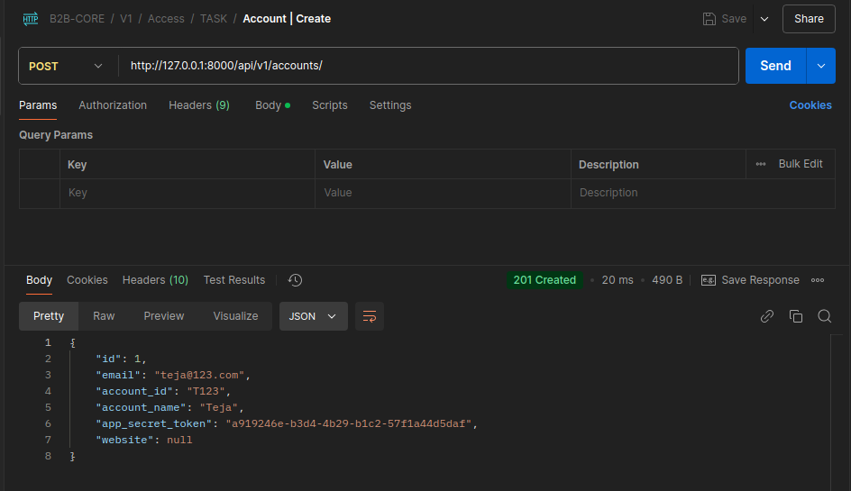
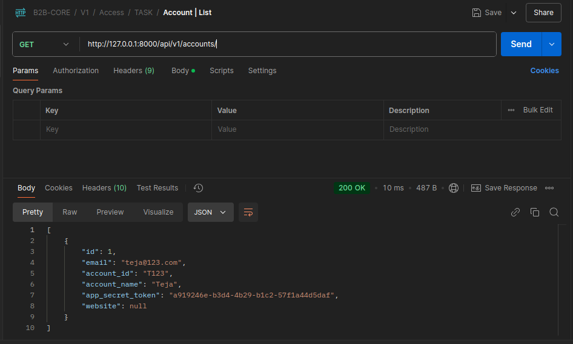
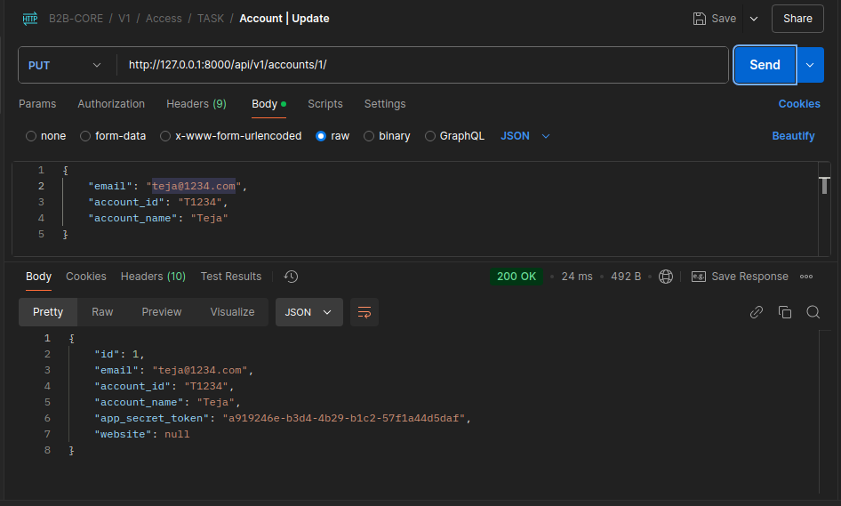
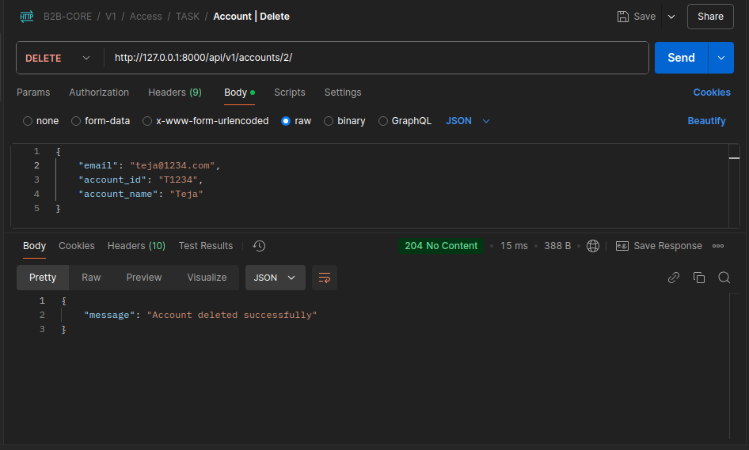
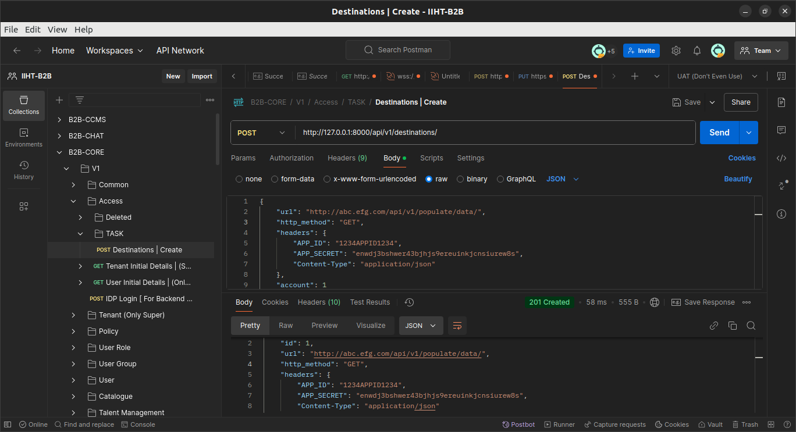
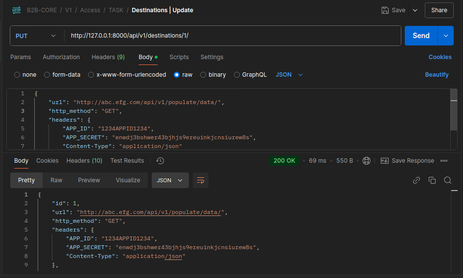
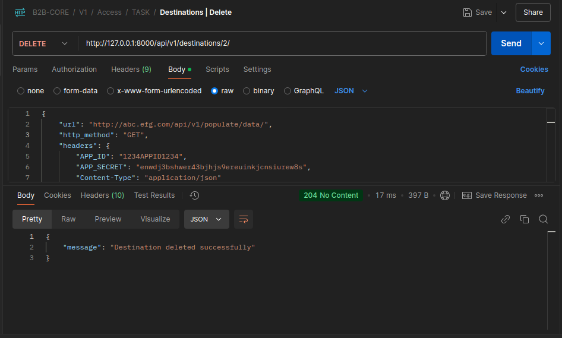
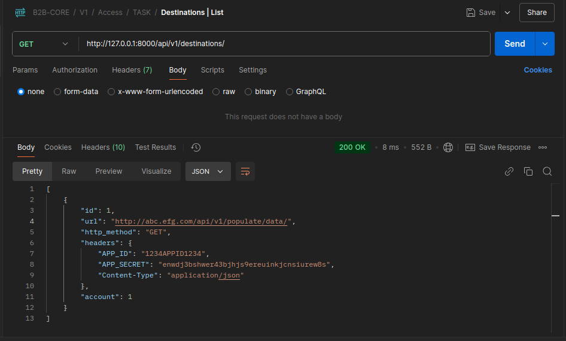
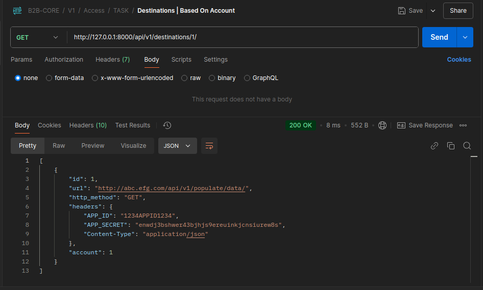
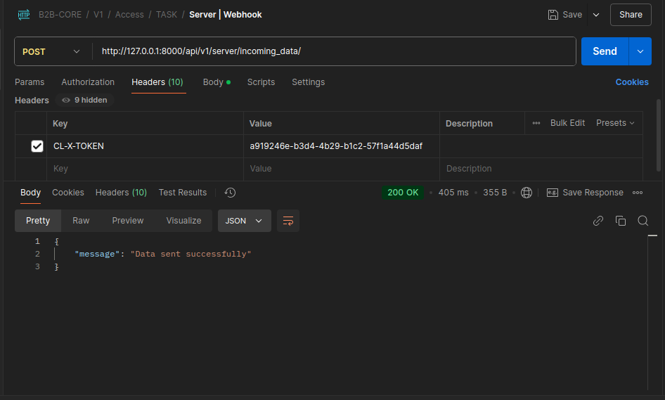

# DataFlowAPP

This application manages accounts and destinations and facilitates data delivery using webhooks!

## Features

List key features (e.g., RESTful APIs, account-destination relationship, extensible database support).

## Database Support

This application uses SQLite as the default database for development and testing. However, it is designed to support other relational databases like PostgreSQL, MySQL.

## Technologies Used

- **Backend Framework**: Django
- **API Framework**: Django REST Framework
- **Database**: SQLite (default), PostgreSQL (optional)
- **Environment Management**: `django-environ`
- **Request Handling**: `requests` library

## 📸 API Docs Screenshot

 

    🔎 View
 

### Account Create

### Account Retrieve

### Account List

### Account Update

### Account Delete

### Destination Create 

### Destination Update 

### Destination Delete 

### Destination List 

### Destination Retrieve 

### Data Pushing Webhook 

